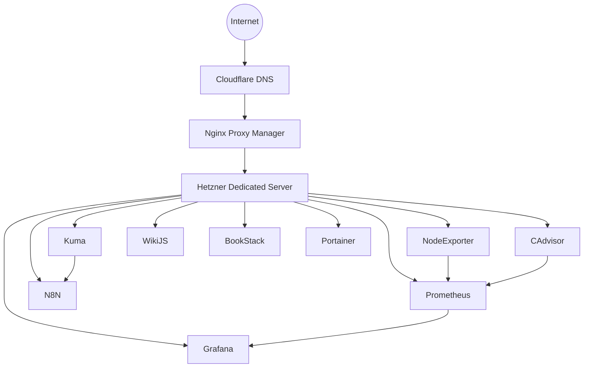

# Silverpaun Homelab

## Overview

SilverPaun Homelab is a production-inspired self-hosted infrastructure project running on a dedicated Hetzner server.

The primary goal of this project is to develop practical skills in Linux administration, monitoring, automation, observability, security operations and AI-assisted infrastructure management.

The entire environment is built using open-source technologies and documented as a long-term learning and portfolio project.

## Architecture


## Current Services

| Service | Purpose |
|----------|----------|
| Grafana | Monitoring dashboards |
| Prometheus | Metrics collection |
| Uptime Kuma | Availability monitoring |
| n8n | Automation workflows |
| WikiJS | Knowledge base |
| BookStack | Documentation |
| Portainer | Container management |
| Nginx Proxy Manager | Reverse proxy |

## Infrastructure

### Hosting

* Hetzner Dedicated Server
* Debian 12

### Container Platform

* Docker Compose
* Portainer

### Reverse Proxy

* Nginx Proxy Manager

### Monitoring

* Grafana
* Prometheus
* Node Exporter
* cAdvisor
* Uptime Kuma

### Automation

* n8n

### Documentation

* WikiJS
* BookStack

---

## Public Services

* grafana.silverpaun.dev
* kuma.silverpaun.dev
* wiki.silverpaun.dev
* docs.silverpaun.dev

---

## Project Roadmap

### Phase 1 - Foundation

* Dedicated Infrastructure
* Reverse Proxy
* Monitoring Stack
* Documentation Stack

### Phase 2 - Automation

* Uptime Kuma Webhooks
* n8n Workflows
* Telegram Notifications
* Email Notifications

### Phase 3 - Observability

* Loki
* Promtail
* Centralized Logging

### Phase 4 - Security

* UFW
* Fail2Ban
* Security Monitoring
* Hardening Improvements

### Phase 5 - AI Operations

* OpenWebUI
* Ollama
* Local LLM Models
* AI-Assisted Infrastructure Analysis

---

## Repository Structure

```text
diagrams/
docs/
scripts/
stacks/
├── automation/
├── documentation/
├── monitoring/
└── reverse-proxy/
```

---

## Status

Current Status: Active Development

Last Updated: June 2026

