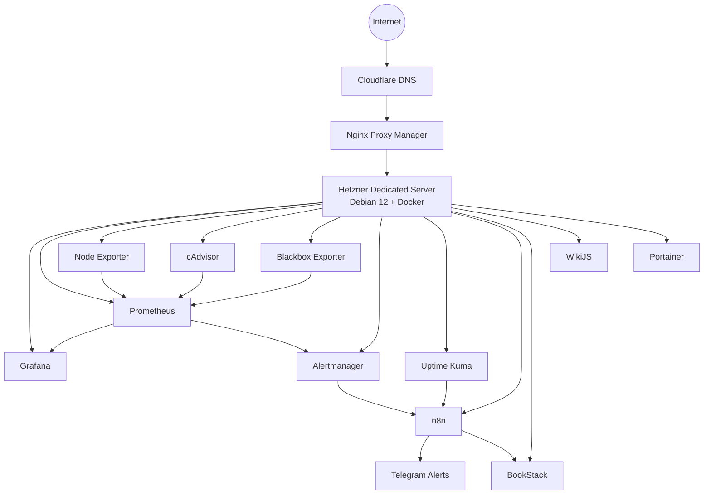

# SilverPaun Homelab

## Overview

**SilverPaun Homelab** is a production-inspired self-hosted infrastructure project running on a dedicated Hetzner server.

The goal of this project is to build practical, real-world skills in:

* Linux system administration
* Docker-based infrastructure
* Monitoring and observability
* Automation workflows
* Documentation and knowledge management
* Security operations
* AI-assisted infrastructure management

The environment is built with open-source technologies and maintained as a long-term learning, documentation and portfolio project.

---

## Architecture



---

## Current Services

| Service                 | Purpose                                      |
| ----------------------- | -------------------------------------------- |
| **Nginx Proxy Manager** | Reverse proxy and public service routing     |
| **Grafana**             | Monitoring dashboards and observability UI   |
| **Prometheus**          | Metrics collection and alert rule evaluation |
| **Node Exporter**       | Linux host metrics                           |
| **cAdvisor**            | Docker container metrics                     |
| **Blackbox Exporter**   | External-style HTTP service probing          |
| **Alertmanager**        | Alert routing and notification dispatch      |
| **Uptime Kuma**         | Availability monitoring and status checks    |
| **n8n**                 | Automation workflows and webhook processing  |
| **BookStack**           | Main infrastructure documentation platform   |
| **WikiJS**              | Secondary knowledge base                     |
| **Portainer**           | Docker container management                  |

---

## Infrastructure

### Hosting

* Hetzner Dedicated Server
* Debian 12
* Docker
* Custom Docker network: `infra-net`

### Reverse Proxy

* Nginx Proxy Manager
* Cloudflare DNS
* Public service access through subdomains

### Container Management

* Docker
* Portainer
* GitHub repository for configuration tracking

---

## Monitoring Stack

The monitoring stack currently includes:

* Prometheus
* Grafana
* Node Exporter
* cAdvisor
* Blackbox Exporter
* Alertmanager
* Uptime Kuma

### Monitoring Layers

The project uses multiple monitoring layers:

#### Host Monitoring

Handled by **Node Exporter**.

Tracks:

* CPU usage
* RAM usage
* Disk usage
* Filesystems
* Network interfaces
* System load

#### Container Monitoring

Handled by **cAdvisor**.

Tracks:

* Container CPU usage
* Container memory usage
* Container disk I/O
* Container network I/O
* Running Docker workloads

#### Service Availability Monitoring

Handled by **Blackbox Exporter**.

Currently monitored internal services:

* Grafana
* Prometheus
* n8n
* BookStack
* Uptime Kuma

Blackbox Exporter checks whether services are actually reachable over HTTP, not only whether their containers are running.

---

## Alerting Pipeline

The current alerting flow is:

```text
Blackbox Exporter
→ Prometheus
→ Alertmanager
→ n8n Webhook
→ Telegram Notification
```

### Current Alert Rule

The first production-style alert is:

```text
ServiceDown
```

Trigger condition:

```text
probe_success == 0 for 1 minute
```

This means that if a monitored service fails its HTTP probe for more than one minute, Prometheus fires an alert.

### Notification Flow

When an alert fires:

1. Blackbox Exporter detects that the service is unavailable.
2. Prometheus evaluates the `ServiceDown` rule.
3. Alertmanager receives the alert.
4. Alertmanager sends a webhook to n8n.
5. n8n sends a Telegram notification.

When the service recovers, Alertmanager sends a resolved event and n8n sends a recovery notification.

Example alert:

```text
🚨 SilverPaun Alert

Status: firing
Alert: ServiceDown
Service: http://uptime-kuma:3001
Severity: critical

Summary:
Service is down: http://uptime-kuma:3001
```

Example recovery:

```text
✅ SilverPaun Resolved

Status: resolved
Alert: ServiceDown
Service: http://uptime-kuma:3001
Severity: critical

Summary:
Service recovered: http://uptime-kuma:3001
```

---

## Automation

Automation is handled through **n8n**.

Current automation use cases:

* Webhook receiver for monitoring alerts
* Telegram alert notifications
* Planned BookStack incident report creation
* Planned one-click infrastructure reports
* Planned backup and service health reporting

### Current Webhook

```text
/webhook/prometheus-alert
```

This webhook receives alerts from Alertmanager and processes them through n8n workflows.

---

## Documentation

Documentation is maintained in:

* BookStack
* WikiJS
* GitHub Markdown files

The long-term goal is to keep GitHub as the source-controlled technical repository and BookStack as the readable operational knowledge base.

Planned documentation structure:

```text
SilverPaun Homelab
├── Infrastructure
├── Monitoring
├── Logging
├── Automation
├── Security
├── Networking
├── Incident Reports
└── AI Operations
```

---

## Repository Structure

```text
diagrams/
docs/
scripts/
stacks/
├── _current-state/
├── automation/
├── docs/
├── logging/
├── monitoring/
│   ├── alertmanager/
│   ├── blackbox/
│   └── prometheus/
│       └── rules/
└── reverse-proxy/
```

---

## Current Monitoring Configuration

### Prometheus Jobs

Current Prometheus scrape jobs:

* `prometheus`
* `node-exporter`
* `cadvisor`
* `blackbox-http`

### Blackbox HTTP Targets

Current Blackbox targets:

```text
http://grafana:3000
http://prometheus:9090
http://n8n:5678
http://bookstack:80
http://uptime-kuma:3001
```

### Alertmanager Receiver

Current receiver:

```text
n8n-webhook
```

Webhook target:

```text
http://n8n:5678/webhook/prometheus-alert
```

---

## Public Services

Current public service endpoints:

* `grafana.silverpaun.dev`
* `kuma.silverpaun.dev`
* `wiki.silverpaun.dev`
* `docs.silverpaun.dev`

---

## Project Roadmap

### Phase 1 - Foundation

* Dedicated Hetzner infrastructure
* Debian 12 base system
* Docker runtime
* Reverse proxy
* Public DNS
* Documentation stack

Status: **In progress**

### Phase 2 - Monitoring and Alerting

* Prometheus
* Grafana
* Node Exporter
* cAdvisor
* Blackbox Exporter
* Alertmanager
* Telegram alerting through n8n

Status: **In progress**

### Phase 3 - Automation

* n8n workflows
* Telegram notifications
* BookStack report generation
* One-click infrastructure reports
* Automated incident pages

Status: **In progress**

### Phase 4 - Logging

Planned:

* Loki
* Promtail
* Centralized Docker logs
* Basic log dashboards in Grafana

Status: **Planned**

### Phase 5 - Asset and Network Management

Planned:

* NetBox
* LibreNMS
* SNMP monitoring
* IPAM
* VLAN documentation
* Device inventory

Status: **Planned**

### Phase 6 - Security Operations

Planned:

* auditd
* Wazuh
* Syslog forwarding
* Linux security hardening
* SSH and sudo monitoring
* Security alert workflows

Status: **Planned**

### Phase 7 - AI Operations

Planned:

* Ollama
* OpenWebUI
* Local LLM experiments
* AI-assisted infrastructure analysis
* Automated summaries from monitoring, logs and documentation

Status: **Planned**

---

## Portfolio Value

This project demonstrates practical experience with:

* Linux server administration
* Docker-based service deployment
* Infrastructure monitoring
* Metrics-based observability
* Alerting pipelines
* Webhook automation
* Documentation workflows
* Incident-style thinking
* Git-based infrastructure tracking

Key implemented workflow:

```text
Implemented an end-to-end observability and alerting pipeline using Prometheus, Blackbox Exporter, Alertmanager, n8n and Telegram notifications for service availability monitoring.
```

---

## Status

Current Status: **Active Development**

Last Updated: **June 2026**

